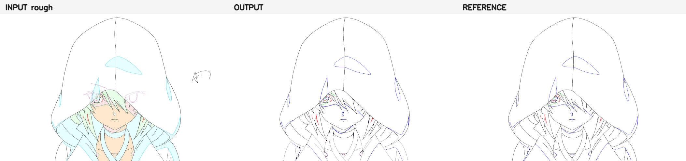
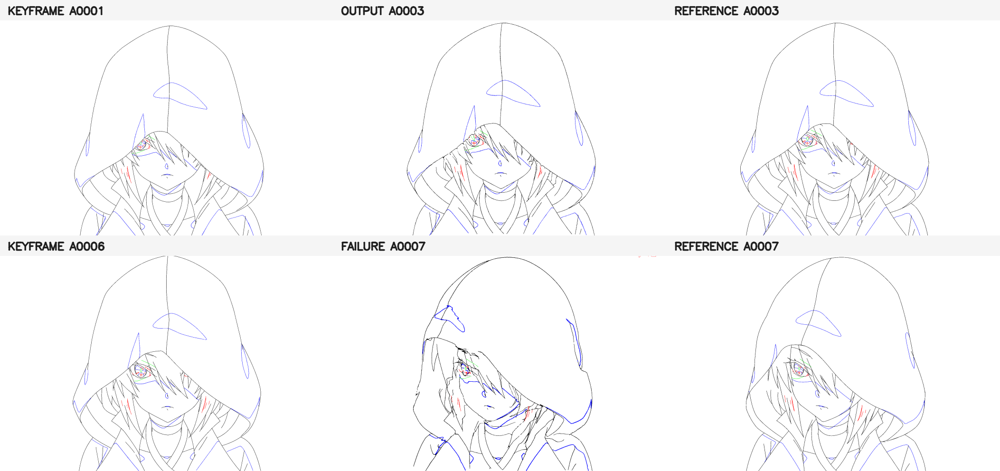
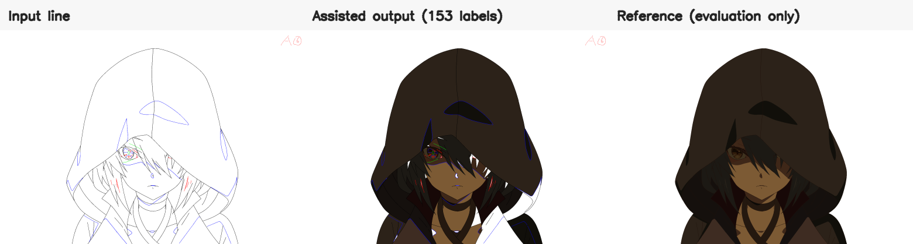

# 面向赛璐璐动画生产的可审计描原、中割与区域上色流水线

**Auditable Rough-Cleanup, Line Inbetweening, and Region Colorization for Cel Animation**  
技术报告（文档修订版 v18）

## 摘要

本文研究赛璐璐动画生产中三个彼此耦合、约束差异显著的基础工序：彩色粗稿到规范线稿的描原、稀疏关键帧到中间帧的中割，以及线稿与色指定驱动的区域上色。与将三题统一为单一生成模型不同，本项目采用**约束优先、分题建模、失败可审计**的工程路线：题 A 以截断距离场几何先验、三折 leave-one-frame-out（LOFO）适配和保守拓扑修复实现严格四色清稿；题 B 将线稿表示为八连通像素图，结合距离场双向运动、沿笔画位移正则和语义色独立传播生成六张 blind 中间帧；题 C 将上色表述为封闭区域分类与跨帧包含传播，并以拒绝机制控制错涂风险。

在 KTK_04_246B 上，题 A 三帧平均 F1@2px 为 **0.9886**，四色符合率 **100%**，参考区域泄漏率 **0.34%**；题 B 的小运动 A0002--A0005 平均 F1@2px 为 **0.9322**，而大转头 A0007/A0008 为 **0.5109/0.5724**，暴露出发丝遮挡与拓扑出生/消失仍是主要瓶颈；题 C 的零标签自动基线达到 **99.97%** 面积精度但仅 **59.25%** 正确覆盖，加入 153 个仅依据线稿、设定图和色卡建立的关键视图区域标签后，面积精度/正确覆盖达到 **99.56%/95.63%**，且输入线像素变化为 **0**。项目同时保留被淘汰方案、数据使用边界、许可证风险与独立验收脚本，避免以参考答案修补、容差指标或不可复现权重夸大正式结果。

**关键词：** 动画智能制作；线稿规范化；中割；区域上色；拓扑保持；可复现评测

## 1. 问题定义与设计原则

输入素材包含同一镜头的粗稿、关键线稿、上色线稿、角色设定图与对应成品。三项任务的损失结构并不相同：描原要求精确色规、单像素几何和闭合性；中割要求运动连续、结构守恒与遮挡处理；上色则明确规定“错涂代价高于留白”。因此，本项目不追求形式上的统一网络，而采用与生产约束匹配的混合系统。

本报告遵循三项原则：

1. **正式结果与诊断上限分离。** 正式目录只包含满足声明数据边界的结果；读取参考答案后形成的修补或 shot-adapted 模型仅进入 diagnostic。
2. **指标与视觉约束并行。** 线稿同时报告 exact、1 px、2 px 双向容差 F1、逐色 F1、线量和闭合性；上色同时报告精度、覆盖、区域指标和线稿逐像素保持。
3. **负结果进入结论。** 对大位移中割，保留失败帧与被拒绝方案，避免只展示易例或将更粗、更密的线误判为改进。

## 2. 评测协议

设预测线像素集合为 $P$，参考线集合为 $G$，$D_r(\cdot)$ 表示半径为 $r$ 的形态学膨胀。容差精确率与召回率定义为

$$
\mathrm{Prec}_r=\frac{|P\cap D_r(G)|}{|P|},\qquad
\mathrm{Rec}_r=\frac{|G\cap D_r(P)|}{|G|},
$$

并报告 $\mathrm{F1}_r=2\mathrm{Prec}_r\mathrm{Rec}_r/(\mathrm{Prec}_r+\mathrm{Rec}_r)$，其中 $r\in\{0,1,2\}$。逐色指标对黑、蓝、红（生产补充版另含绿）分别计算，防止联合线集掩盖语义错色。闭合性通过连通域填色后“前景泄漏进背景的面积比例”衡量。

题 C 仅在输入线稿的四连通白区内评测。面积精度为“已填区域中的正确色像素/全部已填目标像素”，正确覆盖为“正确色像素/参考应上色像素”；两者分列以体现拒绝策略。所有均值均为逐帧宏平均。`tools/validate_submission.py` 从原始素材重新读取图像并 fail-closed 校验，文件存在不等价于通过验收。

## 3. 方法

### 3.1 题 A：几何先验驱动的严格四色描原

题 A 的主要难点是粗稿中的多色辅助线、JPEG/笔触重影、短裂缝及语义色边界。几何分支采用 Deep Sketch Vectorization 风格的无符号/截断距离场表征，将粗线归一化为中心线概率；随后在三张 KTK_04 成对帧上进行三折 LOFO 适配：每一折只使用另外两张成品进行适配，当前留出帧参考仅在输出完成后评分。融合后仅执行保守的 3×3 闭运算、方向一致的短缝连接和场记区域屏蔽，避免凭空增加结构。

正式输出严格限制为白、黑、蓝、红四种精确色。由于参考成品中客观存在绿色生产语义线，项目另提供由当前粗稿高饱和绿色核心恢复的五色补充版，但不以其替代题面规定的四色正式结果。九个 A 推理 checkpoint 能确定性重建结果，但外部预训练语料的逐项许可记录不完整，故明确标为 **research-only**。

### 3.2 题 B：距离场运动与像素图拓扑正则

普通图像插帧对稀疏线稿容易产生模糊、双边和断裂。本项目先将端点线稿转为截断距离场，通过双向 Dense Inverse Search（DIS）估计粗运动；再沿端点/交点之间的有序笔画对位移进行二阶平滑，并将运动作用于八连通像素图的边，而非直接对 RGB 图做混合。蓝、红、绿等稀疏语义线使用独立距离场估计，防止大面积黑线支配对应关系。

A0001--A0006 采用双向插值；A0006--A0009 的大转头采用目标关键帧拓扑的反向场，以减少被遮挡结构的重复出现。正式 B 不加载任何由缺失帧成品训练的 cleanup 权重。由 A0002--A0005 成品训练的残差 U-Net 仅作为 shot-adapted 诊断：虽然其 A0007/A0008 F1 略高，但线量膨胀到参考的约 2.2 倍，因而被拒绝。

### 3.3 题 C：精度优先的区域语义传播

首先从角色设定图的色卡位置提取精确 RGB 调色盘；随后对每帧线稿做四连通白区分解。零标签自动基线仅依赖区域几何、相对位置和设定色阶，对少量高置信大区上色。正式 assisted 配置在 A0001/A0005/A0007/A0009 四个关键视图上建立 153 个 paint-bucket 区域标签，标签的颜色只来自线稿、角色设定图和色卡，不读取中间成品误差。

关键视图区域通过距离场运动、区域包含率和多参考投票向相邻帧传播。若候选颜色冲突、包含率不足或区域跨越语义分界，则保持白色。输出从输入线稿副本开始，只修改原白像素，因此实现严格的线稿零变化。225 标签 dense-assisted 和 oracle/reviewed 配置含参考答案审计后的残差补点，只用于诊断信息上限。

## 4. 实验结果

### 4.1 主结果

| 任务/数据段 | exact F1 | F1@1px | F1@2px | 其他主指标 |
|---|---:|---:|---:|---|
| A 严格四色，3 帧 | 0.8674 | 0.9816 | **0.9886** | 四色符合率 1.000；泄漏率 0.0034 |
| B 小运动 A2--A5 | 0.5953 | 0.8583 | **0.9322** | 生产色规符合率 1.000 |
| B 大转头 A7--A8 | 0.2616 | 0.4399 | **0.5416** | 单帧 0.5109 / 0.5724 |
| C automatic，0 标签 | -- | -- | -- | 面积精度 0.9997；正确覆盖 0.5925 |
| C assisted，153 标签 | -- | -- | -- | **面积精度 0.9956；正确覆盖 0.9563；线变化 0** |

A 的 2 px 指标接近饱和，但 exact F1 明显较低，说明剩余误差主要是 1--2 像素级定位和线宽差异，而不是大结构缺失。B 呈现清晰的运动分层：小位移段具备较好的生产辅助价值，大转头段则因发丝遮挡、轮廓出生/消失和三维转身导致对应关系失效。C 的对照揭示了“精度--覆盖”前沿：规则基线几乎不涂错，但覆盖不足；少量关键视图区域标签能以有限人工输入换取约 36.4 个百分点的正确覆盖提升。

### 4.2 消融与淘汰实验

| 方案 | 数据边界 | 结果 | 决策 |
|---|---|---:|---|
| A 五色生产补充版 | 绿色只从粗稿恢复 | 平均 F1@2px ≈ 0.9913 | 补充，不替代四色正式版 |
| B RAFT/MIBA 近似 | 仅端点，A7/A8 只评测 | 0.2007 / 0.3461 | 大位移对应错误，淘汰 |
| B shot-adapted cleanup | A2--A5 成品监督 | 0.5436 / 0.5930 | 线量约 2.19/2.33 倍，淘汰 |
| B 稀疏点全局 TPS | 33 个复核语义点 | 最佳 0.2095 / 0.2400 | 少量长位移点引发全局扭曲 |
| B 局部残差融合 | 端点/可见性预标注 | 均值仅 +0.00010 | 低于稳健提升阈值 |
| C dense-assisted | 225 标签，含答案后审计 | 精度 0.9933；覆盖 0.9930 | 仅诊断，不列正式成绩 |

该组结果表明，B 的瓶颈不是单纯缺少更强光流或更多算力，而是缺少可靠的笔画级对应与可见性监督；C 的瓶颈则主要是区域语义信息，而非像素生成能力。

### 4.3 KTK_05 进阶验证

进阶镜头用于检验冻结规则、A/B 双层处理和区域传播的可迁移性，但数据边界与主镜头不同，尤其 C-A 明确使用 A1/A3/A5 成品作为训练关键帧，因此不与 KTK_04 正式成绩混算。

| 进阶项 | 结果 | 解释 |
|---|---:|---|
| A 描原：A 层两帧 | F1@2px 0.9382 / 0.9403 | 冻结规则可迁移；样本不足以证明泛化 |
| A 描原：B 嘴部修正层 | 角色 ROI 0.8563 / 1.0000 | 全图受场记区域影响，ROI 更符合任务 |
| B 中割：A 层三帧 | 0.9257 / 0.8978 / 0.9206 | 冻结参数的跨镜头补充验证 |
| B 中割：B 层中点 | 全图/ROI 0.5307 / 0.6283 | 显式处理开放短弧到闭合嘴型 |
| C 上色：A 层五帧 | 均值精度/覆盖 0.9927 / 0.7307 | A1/A3/A5 为监督关键帧；严格保线 |
| C 上色：B2/B3 | 1.0000 / 0.9387 | 精度与覆盖近似相同；线变化 0 |

## 5. 失败分析、局限性与改进方向

**题 A。** 数据只有同镜头三帧，LOFO 只能验证帧间留出，不能证明跨镜头泛化；外部预训练语料许可链不完整，研究 checkpoint 不应进入商业生产。下一步应使用授权明确的多镜头 rough-clean 数据，并按镜头划分训练/验证/测试。

**题 B。** A0007/A0008 的主要错误集中于黑色发丝、脸部遮挡边界和兜帽轮廓的拓扑重连。现有 33 个 A6--A9 人工语义点和 24 条边可见性记录不足以监督通用图匹配模型，且 871 个 visibility 事件仍待复核。下一步应完成端点/交点/笔画段/visibility 的一致性标注，采用图对应与栅格约束联合训练，并以 F1、线量和连通组件共同选模。

**题 C。** 正式 153 标签的人工耗时未可靠记录，因此只报告标签数量，不将估算分钟数作为结论。A0001--A0006 的剩余白区主要位于低置信边界连通衣物区域及少量眼部、发丝小岛；历史邻域盲填正确率仅约 35.8%，故保守留白优于强行填满。下一步应显式建立区域邻接/包含图，并记录逐帧人工时间，报告“精度--覆盖--人工成本”三维曲线。

## 6. 复现、合规与 AI 使用披露

CPU 审计环境为 Python 3.11、OpenCV contrib 4.13、NumPy 2.2、SciPy 1.16；默认命令不覆盖预生成结果，而是重算 18 张正式图的指标、色规和线稿保持。B/C 可在 CPU 上重建；A checkpoint 重建需 CUDA 版 PyTorch 与 RTX 级 GPU。OpenCV 版本固定，以减少亚像素流和栅格化差异。

ChatGPT/Codex 用于题面拆解、代码实现、像素审计、文献检索、实验编排与文档整理；正式方案选择、数据边界、区域语义判断、许可证风险和失败结论由人工复核。由于无法导出精确账单，仅保守估计总用量约 20--40 万 token，不编造 GPU 金额或累计时长。

## 7. 结论

本项目的核心结果不是用单一模型“包办”三项工序，而是建立了一套与动画生产约束对齐的可审计方案：题 A 在严格色规与闭合约束下达到高线集贴合度；题 B 在小运动段有效，但通过大转头失败例明确界定了当前拓扑建模边界；题 C 以精度优先的区域拒绝策略，在 153 个关键视图标签下实现高覆盖且零改线。更重要的是，正式结果、算法基线、诊断上限和负结果均可追溯，为后续面试讨论和真实生产迭代提供了可信起点。

## 参考文献

[1] C. Yan, Y. Li, D. Aneja, M. Fisher, E. Simo-Serra, and Y. Gingold. *Deep Sketch Vectorization via Implicit Surface Extraction*. ACM Transactions on Graphics, 43(4), 2024. DOI: 10.1145/3658197.  
[2] L. Siyao, T. Gu, W. Xiao, H. Ding, Z. Liu, and C. C. Loy. *Deep Geometrized Cartoon Line Inbetweening*. ICCV, pp. 7291--7300, 2023.  
[3] S. Chen and M. Zwicker. *Match-free Inbetweening Assistant (MIBA): A Practical Animation Tool without User Stroke Correspondence*. ACCV, pp. 179--193, 2024.  
[4] T. Zhu, W. Shang, D. Ren, and W. Zuo. *Thin-Plate Spline-based Interpolation for Animation Line Inbetweening*. arXiv:2408.09131, 2024.  
[5] H. Mo, C. Gao, and R. Wang. *Joint Stroke Tracing and Correspondence for 2D Animation*. ACM Transactions on Graphics, 43(3), pp. 1--17, 2024.  
[6] Y. Dai, S. Zhou, Q. Li, C. Li, and C. C. Loy. *Learning Inclusion Matching for Animation Paint Bucket Colorization*. CVPR, pp. 25544--25553, 2024.  
[7] T. Kroeger, R. Timofte, D. Dai, and L. Van Gool. *Fast Optical Flow Using Dense Inverse Search*. ECCV, pp. 471--488, 2016.
